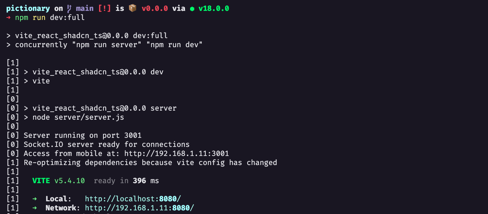
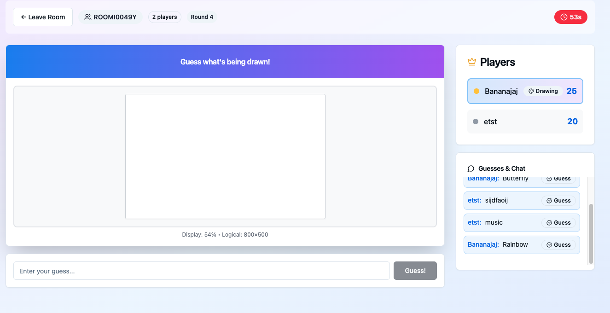
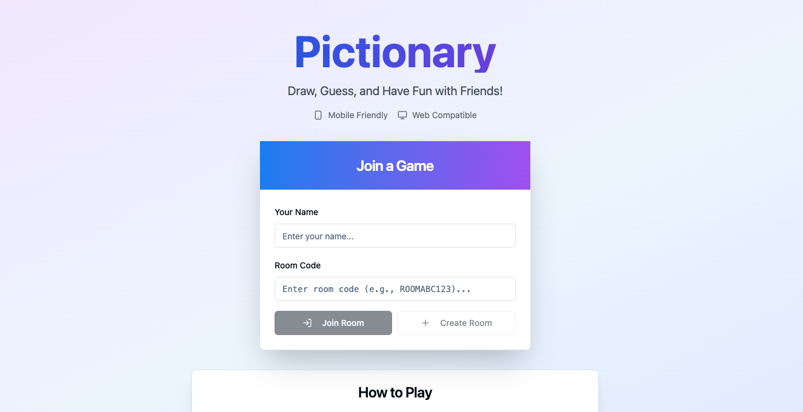

# Pictionary Game

A real-time multiplayer Pictionary game built with React and TypeScript. Players can join from both mobile devices and web browsers to draw and guess together in real-time.

## Features

- 🎨 **Real-time Drawing Canvas** - Smooth drawing experience on both mobile and desktop
- 📱 **Cross-Platform** - Works seamlessly on mobile devices and web browsers
- 👥 **Multiplayer Rooms** - Join existing rooms or create new ones
- 🎯 **Turn-based Gameplay** - Take turns drawing and guessing
- 💬 **Live Chat & Guesses** - Real-time communication and guess submission
- 🏆 **Scoring System** - Track player scores and rankings
- 🎨 **Drawing Tools** - Multiple colors, brush sizes, and eraser tool

## Quick Start

### Prerequisites

- Node.js (v16 or higher)
- npm or yarn

### Local Development

1. **Clone the repository**
   ```bash
   git clone <repository-url>
   cd pictionary-game
   ```

2. **Install dependencies**
   ```bash
   npm install
   ```

3. **Start the development server**
   ```bash
   npm run dev:full
   ```

4. **Open your browser**
   - Navigate to `http://localhost:8080`
   - The game will be running locally

### Mobile Testing

To test the mobile with another player:

1. **Find the network where it is running by finding the  IP address of web running version**
   ```bash
   # On Windows 
   ipconfig
   
   # On Mac/Linux
   ifconfig
   ```

   or just copy what displays in network when app is running like in the image bellow:
   
   
   

2. **Access from mobile device**
   - Connect your mobile device to the same WiFi network
   - Open browser and navigate to `http://YOUR_IP_ADDRESS:8080`

   or 
   
   - Connect your mobile device to the same WiFi network
   - just copy paste on the mobile browser the url of the network in the image example it would be:
    
    ```bash
    http://192.168.1.11:8080/
   ```


## How to Play

1. **Join a Game**
   - Enter your name
   - Enter a room code to join an existing room or create a new one
   - To join a created game just enter your username and past th room code from the existing room
   
   For joining an existing game: Copy the room id from the server running ROOMI0049Y in this case:

   

   and paste it in the room code (don't forget to add your player name).
   
   


2. **Draw Your Turn**
   - When it's your turn, you'll see a word to draw
   - Use the drawing tools (colors, brush sizes, eraser)
   - Draw the word while others guess

3. **Guess Others' Drawings**
   - When others are drawing, type your guesses
   - Correct guesses earn you points
   - Watch the timer and make your guesses count!


### Frontend Components

- **GameLobby** - Main lobby for joining/creating rooms
- **GameRoom** - Active game interface with drawing canvas
- **DrawingCanvas** - Real-time drawing component with touch support
- **PlayerList** - Shows current players and scores
- **ChatBox** - Displays guesses and messages

### Key Features

- **Responsive Design** - Optimized for both mobile and desktop
- **Touch Support** - Full touch drawing capabilities for mobile devices
- **Real-time Updates** - Instant synchronization between players
- **Room Management** - Easy room creation and joining


## Development Notes

- **Mobile-First Design** - Optimized for touch interactions
- **Cross-Browser Compatible** - Works on modern mobile browsers
- **Responsive Layout** - Adapts to different screen sizes
- **Performance Optimized** - Smooth drawing and real-time updates

## Technologies Used

- **React 18** - Frontend framework
- **TypeScript** - Type safety and better development experience
- **Tailwind CSS** - Utility-first CSS framework
- **shadcn/ui** - Modern UI components
- **Lucide React** - Beautiful icons
- **Vite** - Fast development build tool

## Deployment

The game can be deployed to any static hosting service:

1. **Build the project**
   ```bash
   npm run build
   ```

2. **Deploy the `dist` folder** to your preferred hosting service:
   - Vercel
   - Netlify
   - GitHub Pages
   - Any static hosting provider

## Contributing

1. Fork the repository
2. Create a feature branch
3. Make your changes
4. Test on both mobile and desktop
5. Submit a pull request

## License

This project is open source and available under the MIT License.
